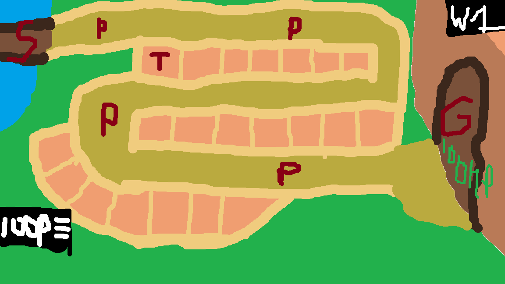

# NimmaDefender
###### Sven Bras - SD2A - 7-9-2026

## Consept
### - Een tower-defence game waar je vanuit de Romeinen de stad Nijmegen moet beschermen tegen de Germanen. Het is leuk omdat het steeds ietsje moeilijker word en je de “Towers” tactisch moet plaatsen. 

## Gameplay
### - In het begin zal je een knop moeten klikken om een wave te starten die Germanen Spawnt, dit moet na iedere wave herhaald worden
### - Je zult "torens" moeten plaatsen die de Germanen aanvallen, Iedere toren kost Punten. Je start met Genoeg punten om 1 toren te plaatsen.
### - Punten zullen te krijgen zijn door het uitschakelen van Germanen.
### - Met genoeg punten zul je een upgrade kunnen kopen om een hoger level "torens" te kunnen kopen.
### - Als het niet lukt de Germanen optijd tegen te houden zullen ze de stadspoort gaan slopen. Zodra deze gesloopt is zal het Game Over zijn.

## Doelgroep
### - Jongere kinderen rond groep 6.
### - Het spel moet makkelijk te begrijpen te zijn voor jongere kinderen.

## Stijl en setting.
### - 2D
### - Rustige art. / Makkelijk om naar te kijken.
### - Speeld zich af net buiten de stadsmuren van Nijmegen.

## Voorbeeld Consept-Art

### - S: Spawn
### - P / ugly green: Path
### - T / pink: Towers
### - G: Goal/ Stadsdeur
### - Groen rechts: De HP van de stadsmuur
### - Links onder: De punten en een uitklap-menu voor het bouwen van de torens
### - Rechts Boven: Wave Counter

## Torens
### - Decanus, Stuurt een groepje van 10 soldaten per 5 seconde die in tegengestelde richting lopen, als dit groepje tegen een Germaan loopt zal het groepje 20DMG per 2 seconden doen heeft zelf 100HP
### - Sagittarii, Staaf op een toren en schiet iedere 4 seconden een pijl op een Germaan in een beperkte radius, de Pijl doet 35 DMG 

## Vijanden 
### - Vijanden lopen NIET achteruit
### - Wigmannen, Een normale snelheid, 100HP, Kunnen slaan met zwaarden en doen 20DMG per 2 seconden
### - Bogamannen, Een langzame snelheid en blijven op afstand, 80HP, Gebruiken een Boog en doen 20 DMG per 2 seconden

## Gameplay loop
### 1.	De speler plaatst een toren.
### 2.	De speler verdient punten.
### 3.	De speler plaatst met die punten meer torens.
### 4.	Met genoeg punten koopt de speler een upgrade waarmee deze sterkere torens kan plaatsen En er een sterkere wave aan Germanen start.

## Progressie
### - Het spel woord steeds moeilijker omdat er met de wave steeds meer en sterke vijanden zullen spawnen en de kosten van de torens zullen hoger worden.

## Risico’s en oplossingen volgens PIO
### - Probleem 1: De Germanen probeeren Nijmegen aan te vallen
### - Impact: ze zullen de stads poort probeeren te slopen
### - Oplossing: Meer “torens” plaatsen om ze tegen te houden
### - Probleem 2: De Germanen zullen sterker worden met iedere wave
### - Impact: Er spawnen meer Germanen en ze doen meer damage
### - Oplossing: Nieuwe sterkere torens plaatsen
### - Probleem 3: Er spawnen Germaanse Boogschutters
### - Impact: Ze zullen je schieten voordat je hun kunt raken
### - Oplossing: Genoeg Decanus plaatsen zodat er genoeg troepen zijn om de Germaanen uit te schakelen of Sagittarii plaatsen aangezien die terug kunnen schieten

## Planning per sprint en mechanics
### - Sprint 1 mechanics: Beweging van de Germanen (en de Romeinen) over het pad. En de StadsPoort
### - Sprint 2 mechanics: Functionalitijd van de Germanen (De germanen DMG laten doen als ze tegen de stadspoort (of de Romeinen) aanlopen.).
### - Sprint 3 mechanics: Torens plaatsen en functionalitijd van de 2 verschillende torens.
### - Sprint 4 mechanics: Functionalitijd van waves (iedere wave de enemy sterker maken) En een upgrade knop om nieuwe sterkere “Towers” te krijgen.
### - Sprint 5 mechanics: Alle Gui en Art inplenmeteren en puntjes op de ii
